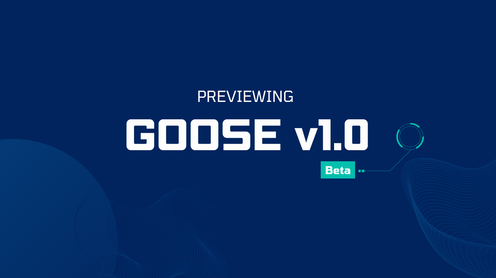
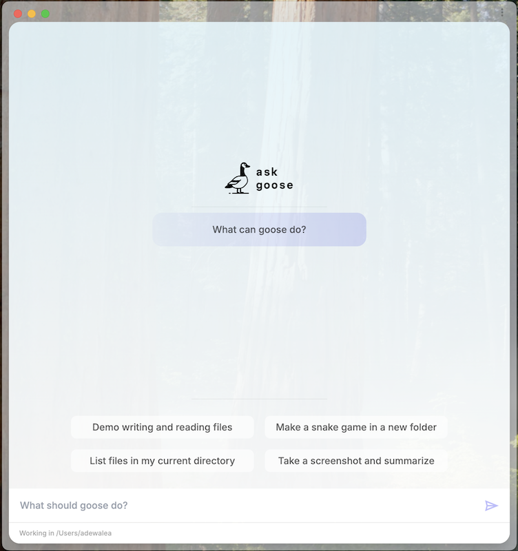

We are excited to share a preview of the new updates coming to Goose with Goose v1.0 Beta!

This major update comes with a bunch of new features and improvements that make Goose more powerful and user-friendly. Here are some of the key highlights.

<!-- truncate -->


## Exciting Features of Goose 1.0 Beta

### 1. Transition to Rust

The core of Goose has been rewritten in Rust. Why does this matter? Rust allows for a more portable and stable experience. This change means that Goose can run smoothly on different systems without the need for Python to be installed, making it easier for anyone to start using it.

### 2. Contextual Memory

Goose will remember previous interactions to better understand ongoing projects. This means you won’t have to keep repeating yourself. Imagine having a conversation with someone who remembers every detail—this is the kind of support Goose aims to offer.

### 3. Improved Plugin System

In Goose v1.0, the Goose toolkit system is being replaced with Extensions. Extensions are modular daemons that Goose can interact with dynamically. As a result, Goose will be able to support more complex plugins and integrations. This will make it easier to extend Goose with new features and functionality.

### 4. Headless mode

You can now run Goose in headless mode - this is useful for running Goose on servers or in environments where a graphical interface is not available.

```sh
cargo run --bin goose -- run -i instructions.md
```

### 5. Goose now has a GUI

Goose now has an electron-based GUI macOS application that provides and alternative to the CLI to interact with Goose and manage your projects.



### 6. Goose alignment with open protocols

Goose v1.0 Beta now uses a custom protocol, that is designed in parallel with [Anthropic’s Model Context Protocol](https://www.anthropic.com/news/model-context-protocol) (MCP) to communicate with Systems. This makes it possible for developers to create their own systems (e.g Jira, ) that Goose can integrate with. 

Excited for many more feature updates and improvements? Stay tuned for more updates on Goose! Check out the [Goose repo](https://github.com/block/goose) and join our [Discord community](https://discord.gg/block-opensource).


<head>
  <meta property="og:title" content="Previewing Goose v1.0 Beta" />
  <meta property="og:type" content="article" />
  <meta property="og:url" content="https://block.github.io/goose/blog/2024/12/06/previewing-goose-v10-beta" />
  <meta property="og:description" content="AI Agent uses screenshots to assist in styling." />
  <meta property="og:image" content="https://block.github.io/goose/assets/images/goose-v1.0-beta-5d469fa73edea37cfccfe8a8ca0b47e2.png" />
  <meta name="twitter:card" content="summary_large_image" />
  <meta property="twitter:domain" content="block.github.io/goose" />
  <meta name="twitter:title" content="Screenshot-Driven Development" />
  <meta name="twitter:description" content="AI Agent uses screenshots to assist in styling." />
  <meta name="twitter:image" content="https://block.github.io/goose/assets/images/goose-v1.0-beta-5d469fa73edea37cfccfe8a8ca0b47e2.png" />
</head>